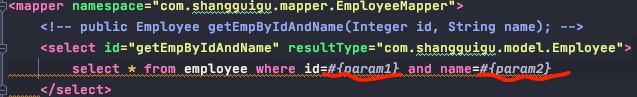
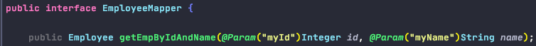
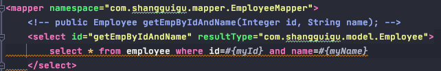

# MyBatis

0. 持久层框架对比: Hibernate 和 MyBatis

1. 核心开发步骤

    - 导入jar 包
    
            - mybatis
            - mysql-connector
            
    - 核心配置文件 MyBatis.xml
    
            作用:
                - 配置数据源信息
                - 配置transactionManager信息
                - MyBatis其他相关配置信息
                - 注册映射配置文件
                - 用于创建sessionFactory
            
    - 映射配置文件
    
            作用:
                - 与interface进行映射, 用于MyBatis创建实现类对象
                    - namespacee: interface名
                    - id: method名
                    - resultType: method返回类型
                - 创建SQL语句, 与Java(业务逻辑)代码解耦分离
    
    - 开发
    
            根据核心配置文件得到SqlSessionFactory
            使用SqlSessionFactory工厂获取sqlSession对象来执行增删改查,
            一个sqlSession就代表和数据库的一次对话, 非线程安全的, 用完关闭

                

2. 核心配置文件

        0). 将dtd约束绑定到config.xml文件, 使其可以自动提示标签内容
                - dtd文件location: mybatis-VersionId.jar/org.apache.ibatis/builder/xml/mybatis-3-config.dtd, mybatis-3-mapper.dtd

       1). <properties> : 引入外部properties配置文件的内容:
                resource: 引入类路径下的资源
                url: 引入网络路径或者磁盘路径下的资源
                
       2). <settings> : 包含很多重要的设置项
                <setting> : 用来设置每一个设置项, name/value
                
       3). <typeAliases> : 别名处理器，为java类型起别名; 默认是类名小写
                <typeAlias type="" alias="" />
                
                
       4).  <environments> : myBatis可以配置多种环境, default用来切换不同环境
               <environment> : 配置具体的一个环境信息, include <transactionManager>和<dataSource>
               <transactionManager
                   type="JDBC"
                   type="MANAGED" />

               <dataSource
                   type="POOLED"
                   type="UNPOOLED"
                   type="JNDI"
                   type=自定义数据源class implements DataSourceFactory接口 />
    
       5). <databaseIdProvide> : 支持多数据库厂商SQL语句
       6). <mappers> : 将SQL映射文件注册到全局配置中
               注册配置文件:
                   resource: 引用类路径下的sql映射文件
                   url: 引用网络路径或磁盘路径下的资源
               注册接口:
                   class: 引用接口
                   1. 有sql映射文件, 映射文件必须与接口同名, 并且放在与接口同一个目录下
                   2. 没有sql映射文件, 所有的sql都是利用注解写在接口上

                   推荐: 比较重要的DAO接口需要写映射xml文件
                        不重要的简单的DAO接口可以使用注解

3. 映射配置文件

        1). mybatis允许增删改直接在接口中定义以下类型返回值, 无需更改映射配置文件
                Integer, Long, Boolean, void

        2). 增删改通过
            sqlSessionFactory.openSession() 获取的session需要手动commit()
            sqlSessionFactory.openSession(true) 获取的session会自动commit()

        
        3). 获取新增记录新生成的主键

        4). 参数处理
            
            a. 单个参数: myBatis不会特殊处理
                #{参数名}: 取出参数值, 参数名是什么都没关系
            b. 多个参数: myBatis会做特殊处理, 多个参数会被封装成一个map,
                默认情况下: 
                    key: param1, param2..
                    value:传入的值

                        
                自定义map的key:

                传入POJO 或传入Map
                    POJO: #{属性名}: 取出传入的POJO的属性名
                    Map: #{key}: 取出Map中对应的值
                
                
                如果多个参数不是业务模型中的数据, 但是会经常使用, 推荐来编写一个TO(Transfer Object)数据传输对象
                    Page {
                        int index;
                        int size;
                    }

            c. #{}和${}取值的区别:
                    #{}:是以预编译的形式, 是参数设置到sql语句中; PreparedStatement：防止sql注入
                    ${}:取出的值直接拼装在sql语句;会有sql注入问题
                    
                    大多情况下, 应该使用#{}取值
                    原生jdbc不支持占位符的地方可以使用${}进行取值
                    比如分表, 排序
                        select * from ${year}_salary where xxx;
                        select * from tbl_employee order by ${f_name} ${order}
