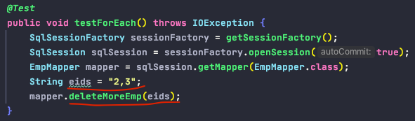
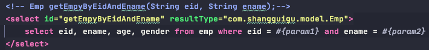

# MyBatis

0. 持久层框架对比: Hibernate 和 MyBatis

            - 半自动ORM持久层框架
            - 分离SQL语句和业务逻辑代码(xmlMapper & interface & 动态代理 - 面向接口编程)
            - 支持SQL定制
            - 存储过程 Stored Procedure
            - 高级映射 Advanced Mapping (resultMap进行自定义映射)
            - 消除了jdbc代码手工设置参数和处理结果集

1. 核心开发步骤

    - 导入jar 包
    
            - mybatis
            - mysql-connector
            
    - 核心配置文件 MyBatis.xml
    
            作用:
                - 配置数据源信息
                - 配置transactionManager信息
                - MyBatis其他相关配置信息
                - 注册映射配置文件
                - 用于创建sessionFactory
            
    - 映射配置文件
    
            作用:
                - 与interface进行映射, 用于MyBatis创建实现类对象
                    - namespacee: interface名
                    - id: method名
                    - resultType: method返回类型
                - 创建SQL语句, 与Java(业务逻辑)代码解耦分离
    
    - 开发
    
            根据核心配置文件得到SqlSessionFactory
            使用SqlSessionFactory工厂获取sqlSession对象来执行增删改查,
            一个sqlSession就代表和数据库的一次对话, 非线程安全的, 用完关闭

                

2. 核心配置文件

        0). 将dtd约束绑定到config.xml文件, 使其可以自动提示标签内容
                - dtd文件location: mybatis-VersionId.jar/org.apache.ibatis/builder/xml/mybatis-3-config.dtd, mybatis-3-mapper.dtd

                      
               - 文件内的内容需有序: properties -> settings -> typeAliases -> environments -> ..
                      
       1). <properties> : 设置资源信息或引入外部properties配置文件:
                resource: 引入类路径下的资源
                url: 引入网络路径或者磁盘路径下的资源
                
       2). <settings> : 改变myBatis实现功能的行为
                <setting> : 用来设置每一个设置项, name/value
                
       3). <typeAliases> : 别名处理器，为java类型起别名; 默认是类名小写 (不建议使用, 不方便维护)
                <typeAlias type="" alias="" />
                
                
       4).  这部分配置, 之后都会由spring进行管理: dataSource, sessionFactory, transactionManager
       
            <environments> : myBatis可以配置多种环境, default用来切换不同环境
               <environment> : 配置具体的一个环境信息, include <transactionManager>和<dataSource>
               <transactionManager
                   type="JDBC" -- jdbc原始事务: conn.setAutoCommit(false); transaction..; conn.commit()
                   type="MANAGED" /> -- spring声明式事务管理

               <dataSource
                   type="POOLED" -- 将db connection进行缓存
                   type="UNPOOLED" -- 每一个connection都是新创建的
                   type="JNDI" -- 调用上下文中的数据源(rarely use)
                   type=自定义数据源class implements DataSourceFactory接口 />
    
       5). <databaseIdProvide> : 支持多数据库厂商SQL语句
       6). <mappers> : 将SQL映射文件注册到全局配置中
               注册配置文件:
                   resource: 引用类路径下的sql映射文件
                   url: 引用网络路径或磁盘路径下的资源
               注册接口:
                   class: 引用接口
                   1. 有sql映射文件, 映射文件必须与接口同名, 并且放在与接口同一个目录下
                   2. 没有sql映射文件, 所有的sql都是利用注解写在接口上

                   推荐: 比较重要的DAO接口需要写映射xml文件
                        不重要的简单的DAO接口可以使用注解

3. 映射配置文件

         1). mybatis允许增删改直接在接口中定义以下类型返回值, 无需更改映射配置文件
                Integer, Long, Boolean, void

        2). sqlSession是否自动提交事务
            sqlSessionFactory.openSession() 获取的session需要手动commit()
            sqlSessionFactory.openSession(true) 获取的session会自动commit()

        
        3). 获取新增记录新生成的主键 -- 封装了原生jdbc的功能
            - useGeneratedKeys: 可以使用自动生成的主键
            - keyProperty: 将自动生成的主键赋值给传递过来的参数的哪一个属性

        4). 参数处理

            a. #{}和${}取值的区别:
                    #{}:是以预编译的形式, 参数设置到sql语句中; PreparedStatement：防止sql注入
                    ${}:取出的值直接拼装在sql语句;会有sql注入问题
                    
                    大多情况下, 应该使用#{}取值
                    除了模糊查询, 批量删除
                
                <1>批量删除传入字符串: 不能使用#{}, 因为会自动添加‘ ‘单引号, 使得SQL语句变成
                    delete from emp where eid in ('1, 2, 3'), 而正确的写法应该是
                    delete from emp where eid in (1, 2, 3), 使用${}拼接字符串不会自动添加' '单引号

            
            b. #{}和#{}参数取值的区别:
                1. 当传输参数为单个String或基本数据类型或其包装类时(字面量)
                    #{}:可以以任意的名字获取参数值
                    ${}:只能以${value}或${_parameter}取值
                    
                    
                2. 当传输参数为一个JavaBean或一个map时:
                    #{}和${}都可以通过属性名直接获取属性值, 但是要注意${}的取字符串引号问题
                    #{}: #{ename}, #{egender}, #{key}
                    ${}: "${ename}", "${egender}", "${key}"

                3. 当传输参数为多个参数时, myBatis会默认将这些参数放在map集合中!!
                    #{}和${}都可以通过两种方式: 参数顺序重要, 名字不重要!!
                        <1>键为arg0, arg1...argN-1作为参数来取值
                        <2>键为param1, param2...paramN作为参数来取值
                    但要注意${}取字符串的引号问题
                    #{}: #{arg0}, #{arg1}, #{param1}, ${param2}
                    ${}: "${arg0}", "${arg1}", "${param1}", "${param2}"
 

         IMPORTANT: But, 如果用顺序参数来取值不方便(还是想用参数名来取值), 可以使用@Param
         就可以像pojo或map一样用指定的param-key来取值, 同时也还可以用param1, param2顺序取值

                4. 当传入参数为List或Array时, mybatis会将List或Array放在map中
                    List以list为键, Array以array为键
                
        5). 自定义高级映射 (多对一/一对一, 一对多, 多对多)
        
            a. 如果返回值是List<T>, resultType指明是List存储元素的类型
            b. 高级结果集映射: resultMap
                - 自定义匹配结果集中的列名和Java对象的属性名, 可解决列名和属性名不一致的case
                - resultMap和resultType需要二选一使用, 开发中通常是用resultMap
                - 一旦使用resultMap, 建议把全列的映射都写上, 哪怕列名和属性名一直, 方便日后排查
                
            <resultMap>: 自定义映射, 处理复杂映射关系

                <id column="eid" property="eid" />
                <id>: 设置主键的映射关系, column设置字段名, property设置属性名
                <result column="ename" property="ename" />
                <result>: 设置非主键的映射关系, column设置字段名, property设置属性名
                    
            c. 联合查询
            
            #1. ManyToOne: 
                - 方式1:

                - 方式2: 使用association, 底层利用反射创建一个关联dept对象

                - 方式3: 使用association + 分步查询, 底层是利用deptMapper进型二次查询

                - 方式3的延迟加载 (只对step查询起作用)

            #2. OneToMany:
                - 方式1: 使用collection

        
                - 方式2: 使用collection + 分步查询

4. 动态SQL
    
        定义: 使用各种标签根据条件动态地拼接SQL

        1). if标签: 传入一个对象, 如果所取的属性值不是null且不是空再进行where的条件匹配, 否则就滤掉, 类似Builder模式的思路: 如果有选择条件才放入SQL where条件语句, 否则不放入
        
            添加 1=1 在where后面以保证where语句语法正确, in case 第一个<if>标签没进入, 或所有<if>标签都没进入

      2). where标签: 添加where关键字并去掉多余的and, 比如如果第一个if判断取值是null的话,           
          后面第一个有效的if判断之前的and会自动被去掉以保证where语句语法正确
          
          eg: select * from tbl_table where and col=val;

        
        注: 使用where标签时, 可能会出现字符串拼串后置and的情况, 参考使用<trim>标签以避免SQL语法错误

        
      3). foreach标签: 
            - 批量插入

    
            - 批量删除

       4). sql标签
            - 设置一段sql片段, 即公共SQL, 可以被当前映射文件中所有的SQL语句使用<include>标签所访问

5. 缓存 -- 不专业

        1). 一级缓存(本地缓存, 默认无需特别配置): sqlSession级别的缓存, 一级缓存是一直开启的
                与数据库同一次会话期间查询到的数据会放在本地缓存中,
                以后如果需要获取相同的数据, 直接从缓存中拿, 没必要再去查询数据库
                
            一级缓存失效的情况(没有使用当前一级缓存的情况, 效果就是还需要再向数据库发出查询):
                a. sqlSession不同
                b. sqlSession相同, 但查询条件/参数不同(当前一级缓存中还没有出现这个数据)
                c. sqlSession相同, 两次查询之间执行了增删改操作, 不包含查操作(这次增删改操作可能对当前数据有影响)
                d. sqlSession相同, 手动清除了以及缓存(缓存清空)

        2). 二级缓存(基于namespace的全局缓存)
                一个会话,查询一条数据, 这个数据就会被放在当前会话的以及缓存中
                如果会话关闭或会话提交, 一级缓存中的数据会被保存到二级缓存中; 新的会话查询信息(使用同一个mapper), 就可以
                参照二级缓存; 不同namespace查出的数据会放在自己对应的缓存中(map)
                a. 核心配置文件配置 <setting name="cacheEnabled" value="true" />
                b. 映射文件配置 <cache eviction="LRU" flushInterval="100000" readOnly="true" />

