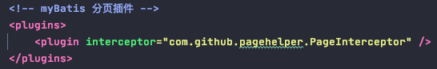
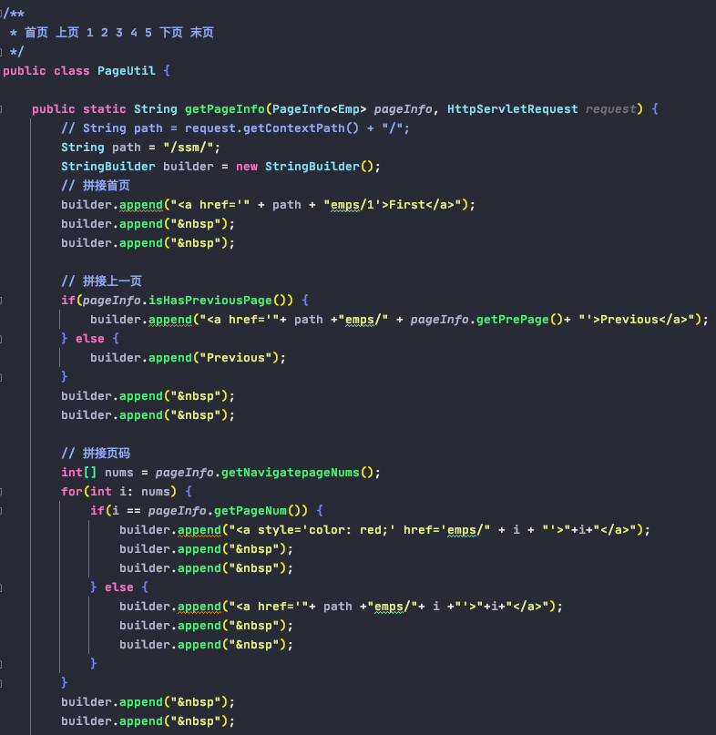
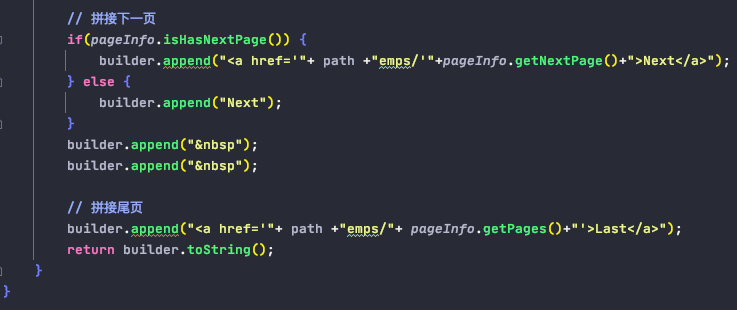
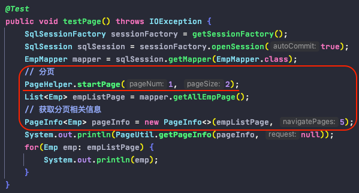

# MyBatis - page helper interceptor (插件)

1. add jars

        - pagehelper-5.0.0.jar
        - jsqlparser-0.9.5.jar

2. config pagination plugin in myBatis-config.xml file

3. concat page string in pageUtil.java

4. test pagination

